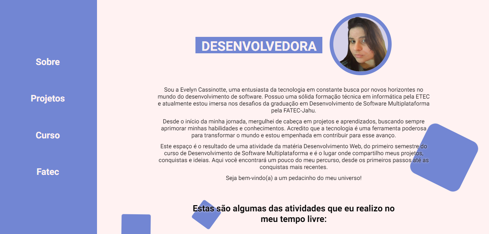
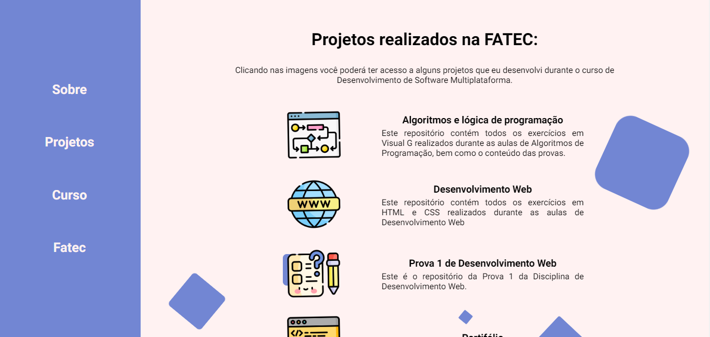
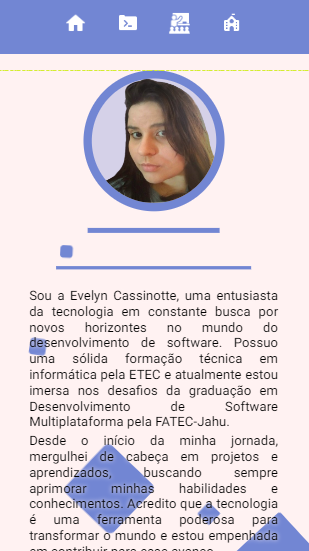
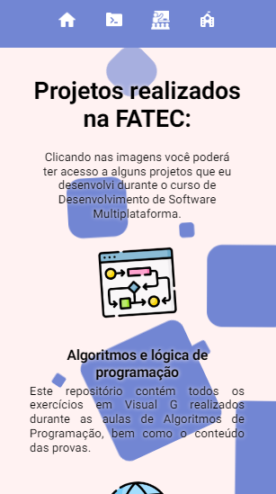

# FATEC - Portfólio
Este repositório foi criado para a realização da tarefa de criação de um portfólio como parte da disciplina de Desenvolvimento Web do primeiro semestre do curso de Desenvolvimento de Software Multiplataforma na FATEC.

## Requerimentos
Para a realização desta atividade, devem se utilizados e conter:

- HTML e CSS puros
- Flex ou Grid
- Imagens e Vídeos
- Animações
- Informações das suas redes profissionais: Linkedin e Github
- Informações sobre seus projetos desenvolvidos
- Informações de contato
- Informações sobre a Fatec

## Como Acessar

 - Acesse o portifólio pelo: [fatec-portifolio.vercel.app](https://fatec-portifolio.vercel.app/) 

## Demonstração

### Desktop

### Smartphone

  
